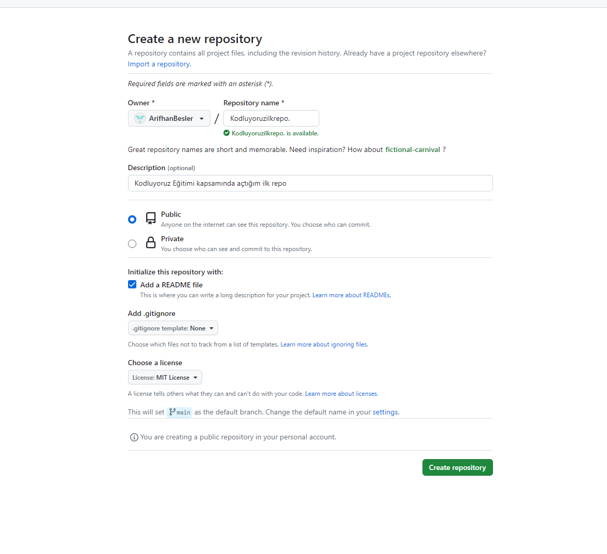

# kodluyoruzilkrepo
### Bu repo [Kodluyoruz](https://kodluyoruz.org/) Front-End Eğitiminde oluşturduğumuz ilk repo. İçerisinde bir adet README dosyası, bir adet de index.html barındırıyor.
(image.png))
## Kurulum
---
### Kullanarak projeyi klonlayın. (Buraya sizin repomuzdan link gelecek)
```
git clone https://github.com/ArifhanBesler/kodluyoruzilkrepo.git
```
## kullanım
---
### Projeyi klonladıktan sonra Visual Studio Code sürümünü açınız.
### Linux için:
```
cd kodluyoruzilkrepo
code .
```
## Katkı
---
### Çekme isteği kabul edilir. Büyük değişiklikler için, lütfen önce neyi değiştirmeyi tartışmak için bir konu açınız.
## Lisans
---
[MİT](https://choosealicense.com/licenses/mit/)